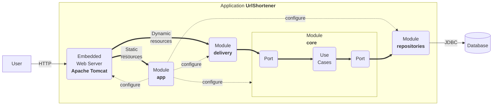

# **Aqualink**

## **Project Overview**

Aqualink is a shortening service. This application allows users to input a long URL and receive a shortened version along with a QR code for easy sharing. The project is built using Kotlin, Spring Boot, and includes front-end components for user interaction.

### **QR Code Generation**

#### PoC Description 

Upon successful URL shortening, a QR code is generated based on the shortened URL. This QR code is displayed on the front-end, allowing users to easily share or scan the link.

#### Justification for the Choice of Libraries

For the QR code generation feature, we selected the ZXing (Zebra Crossing) library. ZXing is a well-established, open-source library that provides robust support for QR code generation and decoding. It is known for its efficiency and reliability, making it an excellent choice for our URL shortening service.

**Comparison with QRGen**

We initially considered using QRGen, another popular library for generating QR codes in Java/Kotlin. QRGen is user-friendly and offers a straightforward API, which simplifies the QR code creation process. However, after evaluating both libraries, we found the following advantages of ZXing:

- **Performance and Flexibility:** ZXing provides greater flexibility in customizing QR code parameters, such as error correction levels, sizes, and formats. This allows us to optimize QR code generation based on user requirements.

- **Community Support:** ZXing has a larger community and more extensive documentation available. This support can be crucial when encountering issues or seeking enhancements in functionality.

- **Compatibility:** ZXing is compatible with a wide range of platforms and languages, ensuring that our application remains scalable and maintainable in the long run.

Finally, while QRGen offered ease of use, the robustness and flexibility of ZXing made it the preferred choice for our application, aligning well with our goals for performance and user experience.

#### Challenges encountered during implementation and how they were addressed.

During the development of the Aqualink URL shortening service, we faced several challenges that required careful consideration and problem-solving.

One significant issue we encountered was the difficulty in linking the generated QR code to the shortened URL. This problem stemmed from not adhering to the principles of Kotlin's Clean Architecture. Initially, our approach lacked a clear structure, which led to confusion in the implementation process. To address this, we took the time to thoroughly study and understand the concepts outlined in The Clean Architecture by Robert C. Martin. This deep dive into clean architecture principles helped us refactor our code and establish a more organized structure, allowing us to correctly link the QR codes to the shortened URLs.

Another challenge we faced was properly sizing the QR code image for optimal display on the front-end. We initially struggled with the visual aspect, which affected user experience. However, by consulting the official ZXing documentation, we were able to identify the necessary adjustments to ensure the QR code displayed correctly and met our design expectations.

Through these challenges, we learned the importance of adhering to architectural principles and leveraging available documentation to solve technical issues effectively.

#### Clear Instructions on How to Run the PoC

- **Clone the Repository:** Start by cloning the Aqualink repository from GitHub to your local machine.

- **Navigate to the Project Directory:** Open your terminal and navigate to the project directory.

- **Execute the Application:** Run the application using the command: ./gradlew bootRun

- **Access the Application**: Open your web browser and navigate to the URL where the Aqualink application is hosted (e.g., `http://localhost:8080`).

- **Input the URL**: In the provided text box on the front-end interface, enter the long URL that you wish to shorten.

- **Shorten the URL**: Click the "Short me!" button. This action will send the URL to the back-end service for processing.

- **View the Result**: Upon successful processing, the application will display the shortened URL along with a QR code. You can click on the shortened URL to access the original link easily or scan the QR code with a mobile device for quick sharing.

#### A Brief Explanation of How the Tests Demonstrate the Functionality of Each Feature

1. **GenerateQRCodeUseCaseTest**:
   - **Test for Valid QR Code Generation**: The test `generateQRCode returns a valid QR code for a valid URL` checks that when a valid URL (`http://example.com`) is passed to the `generateQRCode` method, a non-null and non-empty byte array is returned. This confirms that the functionality to generate a QR code is operational.
   
   - **Test for Invalid URL Handling**: The test `generateQRCode throws exception if url is invalid` validates that the system correctly throws a `QRCodeGenerationException` when an invalid URL (`invalid-url`) or an empty URL is provided. This ensures robust error handling and input validation in the QR code generation process.
   
   - **Test for Encoding Failures**: The test `generateQRCode throws an exception if encoding fails` asserts that when an empty string is provided as a URL, the expected exception is thrown with the correct message. This reinforces the necessity of input validation and the appropriate management of exceptional cases.

1. **QRCodeControllerTest**:
   - **Test for Successful QR Code Retrieval**: The test `getQRCode returns QR code image for valid short URL` confirms that the controller successfully retrieves a QR code when a valid short URL is provided. It checks that the response has an HTTP status of `OK`, and the body contains the expected byte array representing the QR code image. This verifies the integration of the controller with the service layer.
   
   - **Test for Error Handling During QR Code Generation**: The test `getQRCode returns INTERNAL_SERVER_ERROR when QR code generation fails` checks that the controller handles exceptions correctly by returning an `INTERNAL_SERVER_ERROR` status when the QR code generation fails. This test demonstrates the robustness of the controller's error handling mechanism and ensures that the system behaves predictably in the face of errors.

## System requirements and Setup

This application leverages cutting-edge technologies to deliver a robust
and versatile user experience:

1.  **Programming Language**: The application is written in [Kotlin
    2.0.20](https://kotlinlang.org/), a versatile, open-source,
    statically-typed language. Kotlin is renowned for its adaptability
    and is commonly used for Android mobile app development. Beyond
    that, it finds application in server-side development, making it a
    versatile choice.

2.  **Build System**: The application utilizes [Gradle
    8.5](https://gradle.org/) as its build system. Gradle is renowned
    for its flexibility in automating the software building process.
    This build automation tool streamlines tasks such as compiling,
    linking, and packaging code, ensuring consistency and reliability
    throughout development.

3.  **Framework**: The application employs [Spring Boot
    3.3.3](https://docs.spring.io/spring-boot/) as a framework. This
    technology requires Java 17 and is fully compatible up to and
    including Java 21. Spring Boot simplifies the creation of
    production-grade [Spring-based applications](https://spring.io/). It
    adopts a highly opinionated approach to the Spring platform and
    third-party libraries, enabling developers to initiate projects with
    minimal hassle.

## Overall structure

The structure of this project is heavily influenced by [the clean
architecture](https://blog.cleancoder.com/uncle-bob/2012/08/13/the-clean-architecture.html):

- A `core` module where we define the domain entities and the
  functionalities (also known as use cases, business rules, etc.). They
  do not know that this application has a web interface or that data is
  stored in relational databases.
- A `repositories` module that knows how to store domain entities in a
  relational database.
- A `delivery` module that knows how to expose the functionalities on
  the web.
- An `app` module that contains the main application, the configuration
  (i.e., it links `core`, `delivery`, and `repositories`), and the
  static assets (i.e., HTML files, JavaScript files, etc.).



Usually, if you plan to add a new feature:

- You will add a new use case to the `core` module.
- If required, you will modify the persistence model in the
  `repositories` module.
- You will implement a web-oriented solution to expose it to clients in
  the `delivery` module.

Sometimes, your feature will not be as simple, and it may require:

- Connecting to a third party (e.g., an external server). In this case,
  you will add a new module named `gateway` responsible for such a task.
- An additional application. In this case, you can create a new
  application module (e.g., `app2`) with the appropriate configuration
  to run this second server.

Features that require connecting to a third party or having more than a
single app will be rewarded.

## Run

The application can be run as follows:

``` bash
./gradlew bootRun
```

Now you have a shortener service running at port 8080. You can test that
it works as follows:

``` bash
$ curl -v -d "url=http://www.unizar.es/" http://localhost:8080/api/link
*   Trying ::1:8080...
* Connected to localhost (::1) port 8080 (#0)
> POST /api/link HTTP/1.1
> Host: localhost:8080
> User-Agent: curl/7.71.1
> Accept: */*
> Content-Length: 25
> Content-Type: application/x-www-form-urlencoded
> 
* upload completely sent off: 25 out of 25 bytes
* Mark bundle as not supporting multiuse
< HTTP/1.1 201 
< Location: http://localhost:8080/tiny-6bb9db44
< Content-Type: application/json
< Transfer-Encoding: chunked
< Date: Tue, 28 Sep 2021 17:06:01 GMT
< 
* Connection #0 to host localhost left intact
{"url":"http://localhost:8080/tiny-6bb9db44","properties":{"safe":true}}%   
```

And now, we can navigate to the shortened URL.

``` bash
$ curl -v http://localhost:8080/6bb9db44
*   Trying ::1:8080...
* Connected to localhost (::1) port 8080 (#0)
> GET /tiny-6bb9db44 HTTP/1.1
> Host: localhost:8080
> User-Agent: curl/7.71.1
> Accept: */*
> 
* Mark bundle as not supporting multiuse
< HTTP/1.1 307 
< Location: http://www.unizar.es/
< Content-Length: 0
< Date: Tue, 28 Sep 2021 17:07:34 GMT
< 
* Connection #0 to host localhost left intact
```

## Build and Run

The uberjar can be built and then run with:

``` bash
./gradlew build
java -jar app/build/libs/app-0.2024.1-SNAPSHOT.jar
```

## Functionalities

The project offers a minimum set of functionalities:

- **Create a short URL**. See in `core` the use case
  `CreateShortUrlUseCase` and in `delivery` the REST controller
  `UrlShortenerController`.

- **Redirect to a URL**. See in `core` the use case `RedirectUseCase`
  and in `delivery` the REST controller `UrlShortenerController`.

- **Log redirects**. See in `core` the use case `LogClickUseCase` and in
  `delivery` the REST controller `UrlShortenerController`.

The objects in the domain are:

- `ShortUrl`: the minimum information about a short URL
- `Redirection`: the remote URI and the redirection mode
- `ShortUrlProperties`: a handy way to extend data about a short URL
- `Click`: the minimum data captured when a redirection is logged
- `ClickProperties`: a handy way to extend data about a click

## Delivery

The above functionality is available through a simple API:

- `POST /api/link` which creates a short URL from data send by a form.
- `GET /{id}` where `{id}` identifies the short URL, deals with
  redirects, and logs use (i.e. clicks).

In addition, `GET /` returns the landing page of the system.

## Repositories

All the data is stored in a relational database. There are only two
tables.

- **shorturl** that represents short URLs and encodes in each row
  `ShortUrl` related data,
- **click** that represents clicks and encodes in each row `Click`
  related data.

## Reference Documentation

For further reference, please consider the following sections:

- [Official Gradle documentation](https://docs.gradle.org)
- [Spring Boot Gradle Plugin Reference
  Guide](https://docs.spring.io/spring-boot/docs/current/gradle-plugin/reference/htmlsingle/)
- [Spring
  Web](https://docs.spring.io/spring-boot/reference/web/index.html)
- [Spring SQL
  Databases](https://docs.spring.io/spring-boot/reference/data/sql.html)

## Guides

The following guides illustrate how to use some features concretely:

- [Building a RESTful Web
  Service](https://spring.io/guides/gs/rest-service/)
- [Serving Web Content with Spring
  MVC](https://spring.io/guides/gs/serving-web-content/)
- [Building REST services with
  Spring](https://spring.io/guides/tutorials/rest/)
- [Accessing Data with
  JPA](https://spring.io/guides/gs/accessing-data-jpa/)
